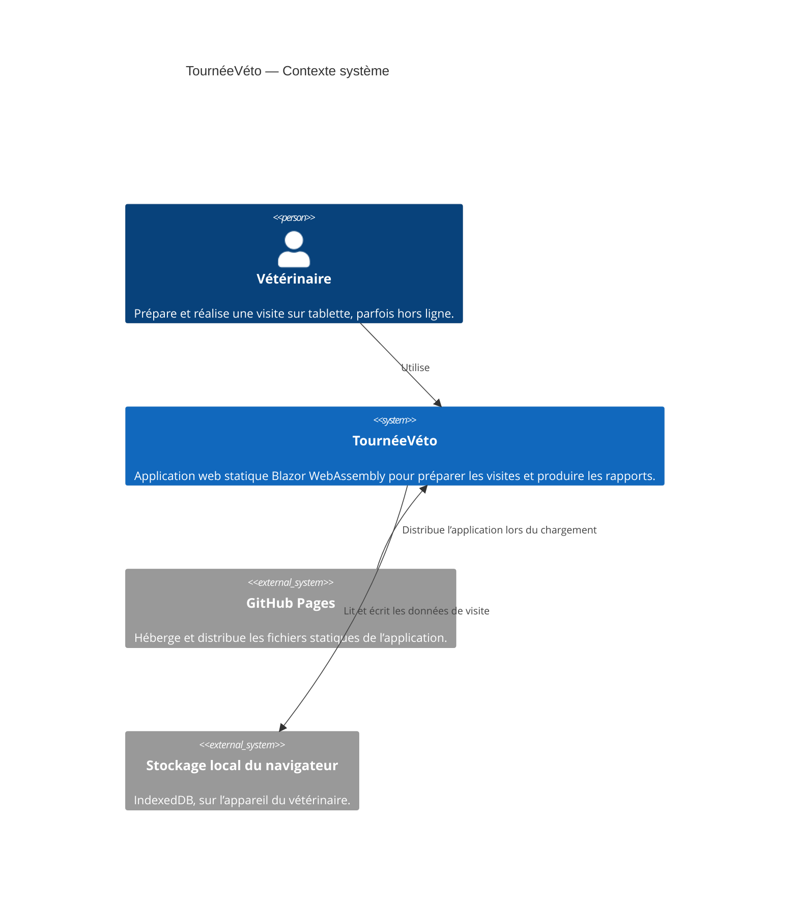
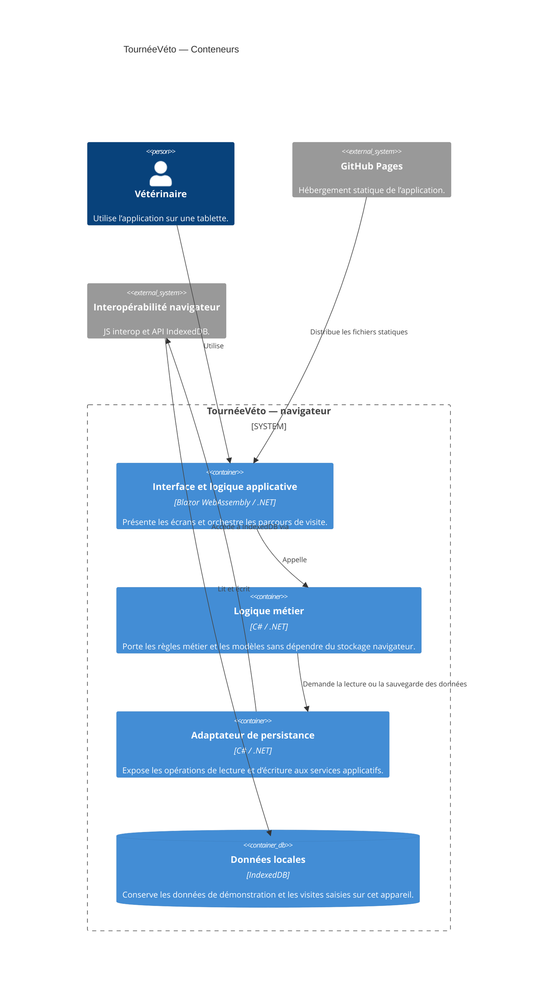

```markdown
# 0001 — Persistance locale des données

- **Date :** 2026-10-08
- **Statut :** Proposé — à valider par l’équipe
- **Décideurs :** Équipe TournéeVéto
- **Liens :** [Contexte produit](../PRODUCT.md) · [Périmètre du MVP](./mvp.md)

## Contexte et problème

Le POC doit fonctionner hors ligne après un premier chargement en ligne, sans backend ni compte. Les visites et les saisies doivent rester disponibles après la fermeture de la visite et le rechargement de la page. L’application est une PWA Blazor WebAssembly statique publiée sur GitHub Pages.

Le choix de stockage doit répondre à ces besoins sans compromettre le délai du POC ni empêcher de séparer la logique métier de l’interface, en prévision d’éventuelles applications WPF et MAUI.

## Décision proposée

Utiliser **IndexedDB dans le navigateur** pour les données métier du POC, derrière une abstraction de persistance indépendante de l’interface.

L’accès à IndexedDB se fera côté navigateur, via JS interop ou une bibliothèque .NET appropriée. Le choix de la bibliothèque pourra être fait pendant l’implémentation, en privilégiant une dépendance légère et maintenue.

- Les visites, les saisies de grille et les bilans de biosécurité sont persistés dans IndexedDB.
- Les données de démonstration peuvent être fournies avec l’application, puis copiées dans le stockage local au premier lancement.
- La logique métier ne dépend pas directement d’IndexedDB : elle utilise une abstraction de dépôt ou de persistance.
- `localStorage` peut être réservé à de petites préférences non critiques, si nécessaire. Il ne sera pas utilisé comme stockage principal des visites.
- EF Core avec SQLite en WebAssembly n’est pas retenu pour le POC.

## Diagrammes C4

### Niveau 1 — Contexte système



### Niveau 2 — Conteneurs



## Options évaluées

### `localStorage` avec Blazored.LocalStorage

**Avantages**
- Mise en place simple pour de petites valeurs.
- Accès pratique depuis .NET via une bibliothèque existante.

**Inconvénients**
- Stockage orienté clé-valeur et limité aux chaînes, ce qui convient moins à des données métier structurées.
- Moins adapté à la croissance des données et aux recherches nécessaires sur les visites.
- Rend plus tentant de coupler les services applicatifs à une API de stockage navigateur.

**Conclusion :** ne pas l’utiliser comme persistance principale. Acceptable uniquement pour des préférences de faible volume et non critiques.

### IndexedDB via JS interop ou bibliothèque .NET

**Avantages**
- Stockage navigateur conçu pour des données structurées et plus volumineuses que celles généralement placées dans `localStorage`.
- Disponible localement, sans backend, et compatible avec l’objectif hors ligne du POC.
- Permet de conserver les données après un rechargement de la page.

**Inconvénients**
- API asynchrone et intégration plus complexe que `localStorage`.
- Les données restent propres au navigateur et à l’appareil ; elles ne sont ni synchronisées ni automatiquement sauvegardées ailleurs.
- Dépend des quotas et du comportement de stockage du navigateur.

**Conclusion :** option retenue, conformément au besoin de persistance IndexedDB du MVP.

### EF Core avec SQLite en WebAssembly

**Avantages**
- Modèle de programmation familier si l’application évolue vers une base relationnelle.
- Peut offrir une abstraction de données utile pour certains scénarios plus complexes.

**Inconvénients**
- Ajoute de la complexité d’intégration et de maintenance dans une application statique Blazor WebAssembly.
- Implique d’évaluer le runtime SQLite, son interopérabilité avec WebAssembly et son impact sur le chargement de l’application.
- Dépasse les besoins de persistance du POC et augmente le risque de ne pas tenir le délai de cinq jours.

**Conclusion :** ne pas retenir pour le POC. Réévaluer uniquement si les besoins futurs justifient une base relationnelle embarquée.

## Conséquences

### Positives

- Le parcours de visite peut fonctionner sans réseau après le premier chargement et la mise en cache nécessaire de l’application.
- Les données de visite survivent à un rechargement de page.
- L’absence de backend, de comptes et de synchronisation est préservée.
- Une abstraction de persistance permet de remplacer l’adaptateur navigateur par une implémentation adaptée à WPF ou MAUI, sans placer IndexedDB dans la logique métier.

### Négatives et limites

- Les données sont propres à un navigateur et à un appareil : elles ne sont pas partagées entre utilisateurs ou appareils.
- Effacer les données du navigateur, perdre l’appareil ou rencontrer une défaillance de stockage peut entraîner la perte des visites.
- Le stockage local ne constitue pas une sauvegarde.
- Le parcours hors ligne dépend aussi de la mise en cache correcte des ressources de l’application ; IndexedDB seul ne rend pas l’application disponible hors ligne.

## Risques et mesures

| Risque | Impact | Mesure |
|---|---|---|
| Données effacées ou appareil perdu | Perte des visites locales | Signaler clairement que les données sont locales et non sauvegardées ; tester la persistance après rechargement. |
| Quota ou éviction du stockage par le navigateur | Échec d’écriture ou perte de données | Gérer et signaler explicitement les erreurs de lecture et d’écriture ; éviter de présenter un échec de sauvegarde comme un succès. |
| Application ou ressources non disponibles hors ligne | Impossible d’ouvrir ou d’utiliser l’application en étable | Tester le parcours complet après un premier chargement en ligne, puis en mode avion, y compris après rechargement. |
| Couplage de la logique métier à IndexedDB | Réutilisation difficile dans WPF ou MAUI | Définir une abstraction de persistance et garder l’implémentation IndexedDB dans l’adaptateur navigateur. |
| Besoin futur de partage ou de synchronisation | IndexedDB seul ne répondra pas au besoin | Traiter la synchronisation comme une décision d’architecture distincte ; elle est hors périmètre du POC. |

## Critères d’acceptation

- Une visite peut être créée et enregistrée hors ligne après le premier chargement en ligne.
- Les actions de grille, les notes et les réponses de biosécurité sont conservées après rechargement de la page.
- Le parcours de visite ne requiert aucune API ni connexion réseau une fois l’application et ses ressources chargées.
- Une erreur de persistance est signalée à l’utilisateur et n’est pas présentée comme une sauvegarde réussie.
- La logique métier ne dépend pas directement de l’API IndexedDB.

## Références

- [Contexte produit](../PRODUCT.md)
- [Périmètre du MVP](./mvp.md)
```