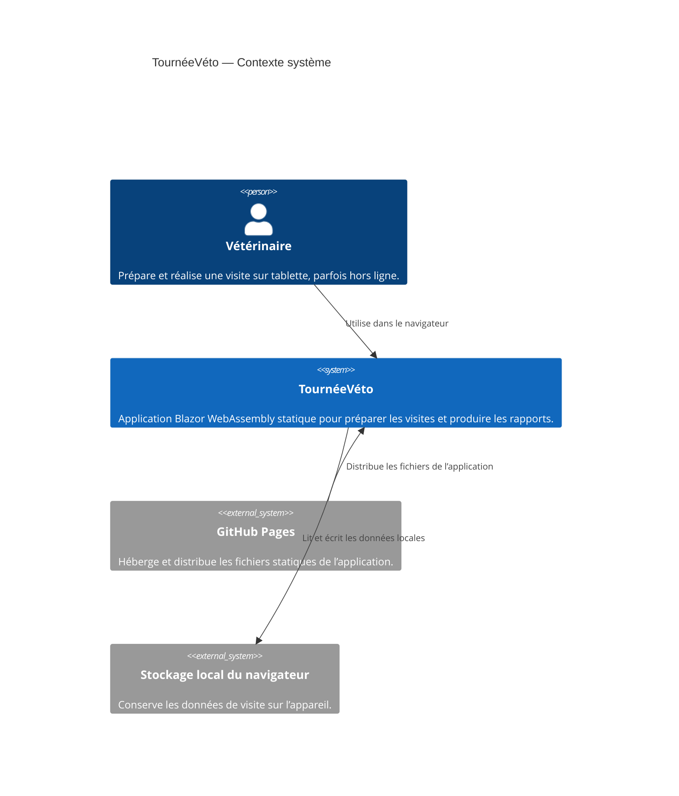
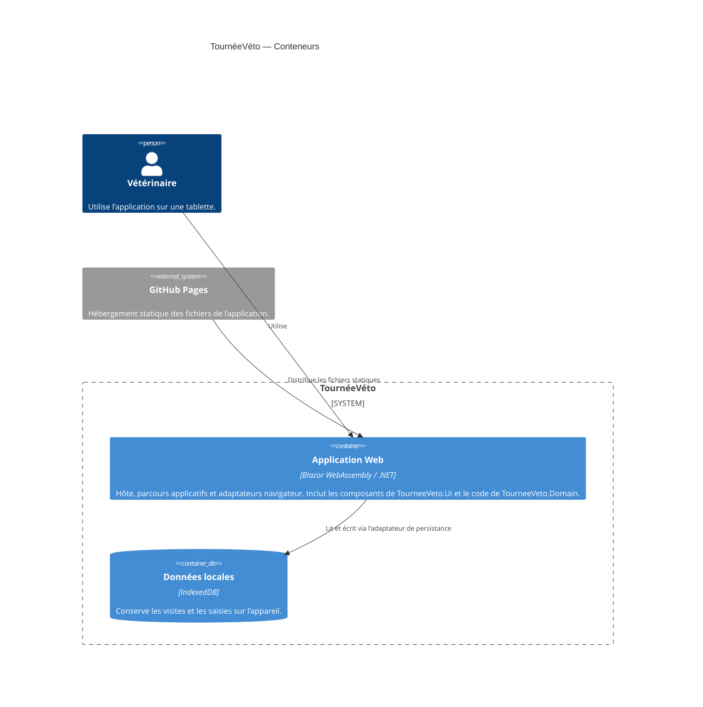

# 0002 — Structure de la solution Blazor

- **Date :** 2026-10-08
- **Statut :** Accepté — révisé le 2026-10-09 sur confirmation du demandeur
- **Décideurs :** Équipe TournéeVéto
- **Liens :** [Contexte produit](../../PRODUCT.md) · [Périmètre du MVP](../mvp.md) · [Persistance locale](./0001-statique.md)

## Contexte et problème

Le POC doit être une application Blazor WebAssembly statique, publiée sur GitHub Pages, utilisable hors ligne après un premier chargement et sans backend. Son périmètre est volontairement limité et son délai de réalisation est de cinq jours.

La logique métier doit rester séparée de l’interface afin de faciliter une éventuelle réutilisation dans des applications WPF ou MAUI. Il faut donc choisir une structure qui établit cette séparation sans introduire prématurément des projets ou des abstractions dont le POC n’a pas besoin.

## Décision

Créer **quatre projets**, conformément à la demande de création de la solution :

1. **`TourneeVeto.Domain`** — une bibliothèque de classes .NET contenant les modèles et règles métier indépendants de l’interface et du navigateur.
2. **`TourneeVeto.Ui`** — une Razor Class Library contenant les composants Blazor réutilisables et leur logique de présentation.
3. **`TourneeVeto.Web`** — l’hôte Blazor WebAssembly PWA statique contenant le démarrage, les routes, l’orchestration applicative et les adaptateurs propres au navigateur, dont le futur accès à IndexedDB.
4. **`TourneeVeto.Tests`** — les tests xUnit des modèles et règles métier ainsi que les tests bUnit des composants Razor.

Références : `Ui → Domain`, `Web → Ui`, `Tests → Domain` et `Tests → Ui`. Web accède au Domain par la référence transitive. Domain ne référence ni Blazor, ni JavaScript interop, ni API du navigateur. Domain et Ui ne sont pas déployés séparément : leur code est compilé et livré avec l’application WebAssembly.

**Révision de la proposition initiale :** la RCL est explicitement demandée pour isoler dès maintenant les composants de l’hôte. Elle ne garantit pas le partage avec des interfaces WPF ou MAUI natives ; les composants pourront être utilisés dans de futurs hôtes Blazor Hybrid. La réutilisation de la logique métier reste assurée par Domain. Aucun projet WPF, MAUI ou serveur n’est ajouté au POC.

Structure cible :

```text
src/
├── TourneeVeto.Domain/
│   ├── Biosecurity/
│   ├── Herd/
│   ├── Visits/
│   └── DemoData.cs
├── TourneeVeto.Ui/
│   └── Components/
└── TourneeVeto.Web/
    ├── Pages/
    ├── Layout/
    └── wwwroot/
tests/
└── TourneeVeto.Tests/
    ├── Domain/
    └── Ui/
```

Cette structure décrit le socle créé. Les modèles de biosécurité, de vaches et de visites ainsi que les données fictives existantes sont conservés. Ne créer que les dossiers nécessaires aux fonctionnalités effectivement implémentées. Lors de l’ajout de la persistance, placer les contrats indépendants du navigateur dans Domain, l’orchestration dans `Web/Application` et l’adaptateur IndexedDB dans `Web/Infrastructure/Persistence`, conformément à l’ADR 0001. Ui consomme des modèles et des contrats ; il ne doit pas dépendre de l’adaptateur Web.

## Diagrammes C4

### Niveau 1 — Contexte système



### Niveau 2 — Conteneurs

Domain et Ui sont des bibliothèques référencées par l’application, pas des conteneurs déployés indépendamment. Tests n’est pas livré au navigateur.



## Options évaluées

### Un seul projet Blazor

**Avantages**
- Structure initiale et configuration simples.
- Moins de projets à créer et à maintenir pour un POC court.

**Inconvénients**
- La séparation entre logique métier et interface repose surtout sur des conventions internes au projet.
- Les règles métier risquent de dépendre progressivement de Blazor ou du navigateur.
- La réutilisation ultérieure des règles dans WPF ou MAUI devient moins explicite.

**Conclusion :** acceptable pour un prototype jetable, mais moins adapté à l’objectif explicite de séparation de la logique métier.

### Projet Domain, Razor Class Library et hôte Web

**Avantages**
- Séparation nette entre logique métier, composants d’interface partagés et hôte.
- Une RCL peut servir plusieurs applications Blazor.

**Inconvénients**
- Aucun second hôte Blazor n’est prévu pour le POC.
- Une RCL ne rend pas, à elle seule, les composants réutilisables dans une interface WPF ou MAUI native.
- Ajoute de la configuration et des frontières de projet sans besoin actuel.

**Conclusion :** option retenue après confirmation explicite du demandeur le 2026-10-09, avec un projet de tests. Le coût de configuration supplémentaire est accepté pour isoler les composants de l’hôte dès le socle.

### Projet Domain et hôte Web Blazor

**Avantages**
- La logique métier est isolée dans une bibliothèque .NET référençable par de futurs clients.
- L’interface et les intégrations navigateur restent dans l’application Web.
- La structure demeure suffisamment simple pour le périmètre et le délai du POC.

**Inconvénients**
- Implique une référence de projet et une structure initiale légèrement plus élaborée qu’un projet unique.
- La réutilisation du Domain dans WPF ou MAUI ne garantit pas, à elle seule, le partage des interfaces ou des parcours.

**Conclusion :** proposition initiale remplacée par la structure Domain, Ui, Web et Tests. Elle demeure une alternative plus simple, mais ne correspond pas à la demande confirmée.

## Conséquences

### Positives

- Les règles métier peuvent être testées sans démarrer l’application Blazor ni accéder au navigateur.
- Le Domain ne dépend pas d’IndexedDB et reste référençable depuis de futurs projets .NET.
- Ui garde les composants réutilisables ; Web garde les routes, la composition et les intégrations propres au navigateur.
- Les composants sont testables avec bUnit, sans démarrer l’hôte Web.
- Le déploiement reste celui d’une application statique unique sur GitHub Pages.

### Négatives et limites

- Le découpage en projets demande de maintenir des références et une structure supplémentaires.
- Les composants Razor ne sont pas partagés avec d’éventuelles applications natives par le seul fait d’avoir un projet Domain.
- Une évolution vers WPF ou MAUI nécessitera de concevoir ces interfaces séparément et de vérifier la compatibilité des dépendances partagées.

## Risques et mesures

| Risque | Impact | Mesure |
|---|---|---|
| La logique métier dépend d’API Blazor ou navigateur | Réutilisation et tests du Domain difficiles | Garder ces dépendances dans `TourneeVeto.Web` et vérifier que `TourneeVeto.Domain` ne référence que des bibliothèques .NET appropriées. |
| La RCL ajoute une frontière sans second hôte dans le POC | Complexité et délai supplémentaires | Limiter Ui aux composants réutilisables, sans multiplier les projets ni anticiper les hôtes natifs. |
| Le projet Domain devient un simple intermédiaire ou un fourre-tout | Frontières peu claires et maintenance accrue | N’y placer que les modèles et règles métier réellement indépendants de l’interface ; éviter les couches sans besoin démontré. |
| Une dépendance du Domain n’est pas compatible avec de futurs clients | Réutilisation WPF/MAUI limitée | Garder le Domain indépendant des API WebAssembly et réévaluer ses dépendances avant la création d’un client natif. |
| Le découpage ralentit la livraison du POC | Fonctionnalités Must incomplètes | Limiter le Domain aux éléments nécessaires au parcours du MVP et ne pas créer de projets supplémentaires pour anticiper des scénarios futurs. |

## Critères d’acceptation

- La solution contient Domain, Ui (RCL), Web (Blazor WebAssembly PWA) et Tests (xUnit et bUnit).
- Les références sont `Ui → Domain`, `Web → Ui`, `Tests → Domain` et `Tests → Ui` ; Domain ne référence aucune API propre au navigateur.
- Les règles métier retenues peuvent être testées sans démarrer l’interface Web.
- La publication produit les fichiers statiques attendus par GitHub Pages, sans backend.
- Le parcours du MVP, y compris la persistance locale décrite dans la décision 0001, reste disponible.

## État du socle et validation

- SDK figé dans `global.json` : `10.0.401`, `rollForward: latestFeature`. Tous les projets ciblent `net10.0`.
- `Directory.Build.props` active les références nullables, les imports implicites et le traitement des avertissements en erreurs.
- `NuGet.Config` limite la restauration à nuget.org pour ne pas dépendre des flux privés configurés sur une machine.
- L’accueil français affiche le jeu de données fictives à travers un composant Ui. Les tests vérifient les effectifs, la reproductibilité et l’affichage.
- La grille de régie, les bilans saisissables, IndexedDB et les rapports du MVP ne sont pas encore implémentés. Les critères fonctionnels des ADR 0001 et 0003 restent à vérifier lors de ces étapes.
- La PWA utilise le service worker du modèle .NET ; le mode hors ligne est actif en publication, pas en développement. Le premier chargement en ligne et les tests navigateur hors ligne restent nécessaires.
- Pour GitHub Pages, adapter `<base href="/">` dans `src/TourneeVeto.Web/wwwroot/index.html` au chemin réel du dépôt (par exemple `/tourneeveto/`) avant publication. Le service worker dérive sa base de sa portée d’enregistrement. La publication génère `404.html` depuis la page d’entrée finale et `.nojekyll`, sans déplacer `_framework` (ADR 0003). Déployer tout le contenu publié de `wwwroot`.
- Validation à la racine : `dotnet build`, puis `dotnet test` (xUnit v2 via VSTest). Aucun démarrage de l’application n’est nécessaire.

## Références

- [Contexte produit](../../PRODUCT.md)
- [Périmètre du MVP](../mvp.md)
- [Persistance locale des données](./0001-statique.md)