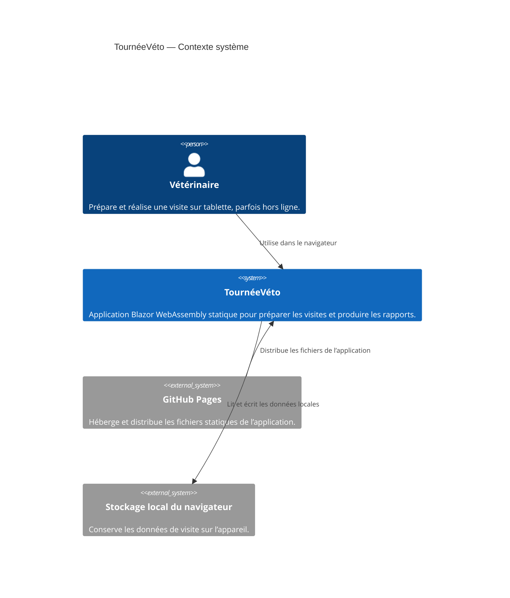
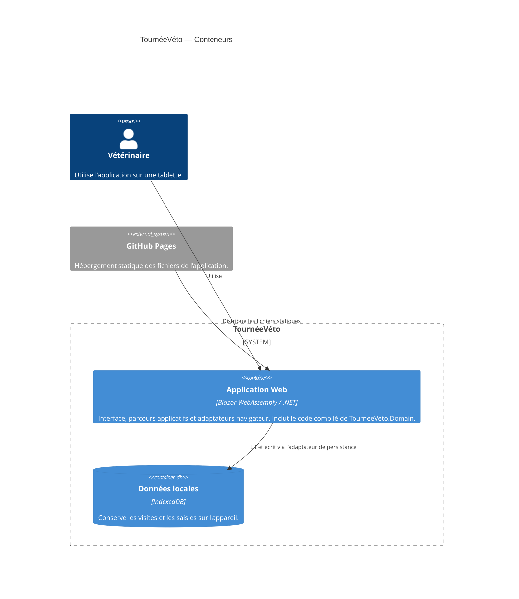

# 0002 — Structure de la solution Blazor

- **Date :** 2026-10-08
- **Statut :** Proposé — à valider par l’équipe
- **Décideurs :** Équipe TournéeVéto
- **Liens :** [Contexte produit](../../PRODUCT.md) · [Périmètre du MVP](../mvp.md) · [Persistance locale](./0001-statique.md)

## Contexte et problème

Le POC doit être une application Blazor WebAssembly statique, publiée sur GitHub Pages, utilisable hors ligne après un premier chargement et sans backend. Son périmètre est volontairement limité et son délai de réalisation est de cinq jours.

La logique métier doit rester séparée de l’interface afin de faciliter une éventuelle réutilisation dans des applications WPF ou MAUI. Il faut donc choisir une structure qui établit cette séparation sans introduire prématurément des projets ou des abstractions dont le POC n’a pas besoin.

## Décision proposée

Créer **deux projets** :

1. **`TourneeVeto.Domain`** — une bibliothèque de classes .NET contenant les modèles et règles métier indépendants de l’interface et du navigateur.
2. **`TourneeVeto.Web`** — l’application Blazor WebAssembly statique contenant les pages et composants d’interface, l’orchestration des parcours et les adaptateurs propres au navigateur, dont l’accès à IndexedDB.

`TourneeVeto.Web` référence `TourneeVeto.Domain`. Le projet Domain ne référence ni Blazor, ni JavaScript interop, ni API du navigateur. Il n’est pas déployé séparément : son code est compilé et livré avec l’application WebAssembly.

**Ne pas créer de Razor Class Library (RCL) pour le POC.** L’interface n’a qu’un hôte Blazor prévu. Une RCL pourra être introduite si plusieurs hôtes Blazor doivent réellement partager des composants. La réutilisation de la logique métier dans WPF ou MAUI relève de `TourneeVeto.Domain`, et non d’une RCL.

Structure cible :

```text
src/
├── TourneeVeto.Domain/
│   ├── Models/
│   └── Rules/
└── TourneeVeto.Web/
    ├── Pages/
    ├── Components/
    ├── Application/
    └── Infrastructure/
        └── Persistence/
```

Cette structure est indicative : ne créer que les dossiers nécessaires aux fonctionnalités effectivement implémentées.

## Diagrammes C4

### Niveau 1 — Contexte système



### Niveau 2 — Conteneurs

Le projet Domain est une bibliothèque référencée par l’application, pas un conteneur déployé indépendamment.



## Options évaluées

### Un seul projet Blazor

**Avantages**
- Structure initiale et configuration simples.
- Moins de projets à créer et à maintenir pour un POC court.

**Inconvénients**
- La séparation entre logique métier et interface repose surtout sur des conventions internes au projet.
- Les règles métier risquent de dépendre progressivement de Blazor ou du navigateur.
- La réutilisation ultérieure des règles dans WPF ou MAUI devient moins explicite.

**Conclusion :** acceptable pour un prototype jetable, mais moins adapté à l’objectif explicite de séparation de la logique métier.

### Projet Domain, Razor Class Library et hôte Web

**Avantages**
- Séparation nette entre logique métier, composants d’interface partagés et hôte.
- Une RCL peut servir plusieurs applications Blazor.

**Inconvénients**
- Aucun second hôte Blazor n’est prévu pour le POC.
- Une RCL ne rend pas, à elle seule, les composants réutilisables dans une interface WPF ou MAUI native.
- Ajoute de la configuration et des frontières de projet sans besoin actuel.

**Conclusion :** ne pas retenir pour le POC. Réévaluer la RCL si plusieurs hôtes Blazor doivent partager des composants.

### Projet Domain et hôte Web Blazor

**Avantages**
- La logique métier est isolée dans une bibliothèque .NET référençable par de futurs clients.
- L’interface et les intégrations navigateur restent dans l’application Web.
- La structure demeure suffisamment simple pour le périmètre et le délai du POC.

**Inconvénients**
- Implique une référence de projet et une structure initiale légèrement plus élaborée qu’un projet unique.
- La réutilisation du Domain dans WPF ou MAUI ne garantit pas, à elle seule, le partage des interfaces ou des parcours.

**Conclusion :** option proposée. Elle réalise la séparation utile maintenant, sans introduire de RCL avant qu’un besoin de partage de composants Blazor existe.

## Conséquences

### Positives

- Les règles métier peuvent être testées sans démarrer l’application Blazor ni accéder au navigateur.
- Le Domain ne dépend pas d’IndexedDB et reste référençable depuis de futurs projets .NET.
- Le projet Web garde la responsabilité des pages, composants et intégrations propres au navigateur.
- Le déploiement reste celui d’une application statique unique sur GitHub Pages.

### Négatives et limites

- Le découpage en projets demande de maintenir des références et une structure supplémentaires.
- Les composants Razor ne sont pas partagés avec d’éventuelles applications natives par le seul fait d’avoir un projet Domain.
- Une évolution vers WPF ou MAUI nécessitera de concevoir ces interfaces séparément et de vérifier la compatibilité des dépendances partagées.

## Risques et mesures

| Risque | Impact | Mesure |
|---|---|---|
| La logique métier dépend d’API Blazor ou navigateur | Réutilisation et tests du Domain difficiles | Garder ces dépendances dans `TourneeVeto.Web` et vérifier que `TourneeVeto.Domain` ne référence que des bibliothèques .NET appropriées. |
| La RCL est ajoutée sans besoin de partage concret | Complexité et délai supplémentaires | N’introduire une RCL que lorsqu’un second hôte Blazor doit réutiliser des composants identifiés. |
| Le projet Domain devient un simple intermédiaire ou un fourre-tout | Frontières peu claires et maintenance accrue | N’y placer que les modèles et règles métier réellement indépendants de l’interface ; éviter les couches sans besoin démontré. |
| Une dépendance du Domain n’est pas compatible avec de futurs clients | Réutilisation WPF/MAUI limitée | Garder le Domain indépendant des API WebAssembly et réévaluer ses dépendances avant la création d’un client natif. |
| Le découpage ralentit la livraison du POC | Fonctionnalités Must incomplètes | Limiter le Domain aux éléments nécessaires au parcours du MVP et ne pas créer de projets supplémentaires pour anticiper des scénarios futurs. |

## Critères d’acceptation

- La solution contient `TourneeVeto.Domain` et `TourneeVeto.Web`, sans projet RCL pour le POC.
- `TourneeVeto.Web` référence `TourneeVeto.Domain`, et le Domain ne référence pas le projet Web ni d’API propres au navigateur.
- Les règles métier retenues peuvent être testées sans démarrer l’interface Web.
- La publication produit les fichiers statiques attendus par GitHub Pages, sans backend.
- Le parcours du MVP, y compris la persistance locale décrite dans la décision 0001, reste disponible.

## Références

- [Contexte produit](../../PRODUCT.md)
- [Périmètre du MVP](../mvp.md)
- [Persistance locale des données](./0001-statique.md)