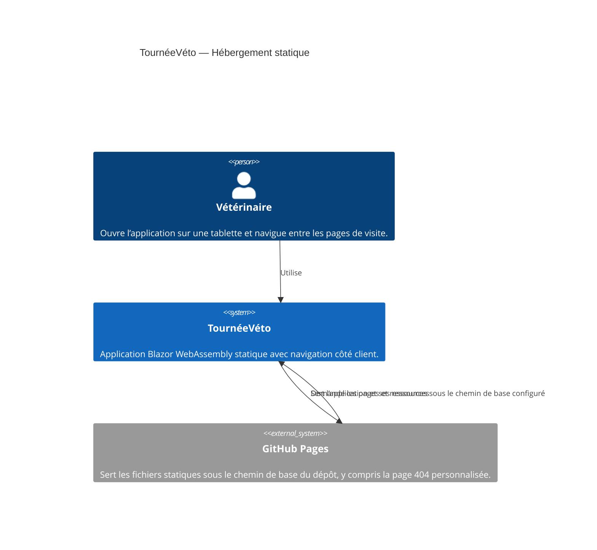
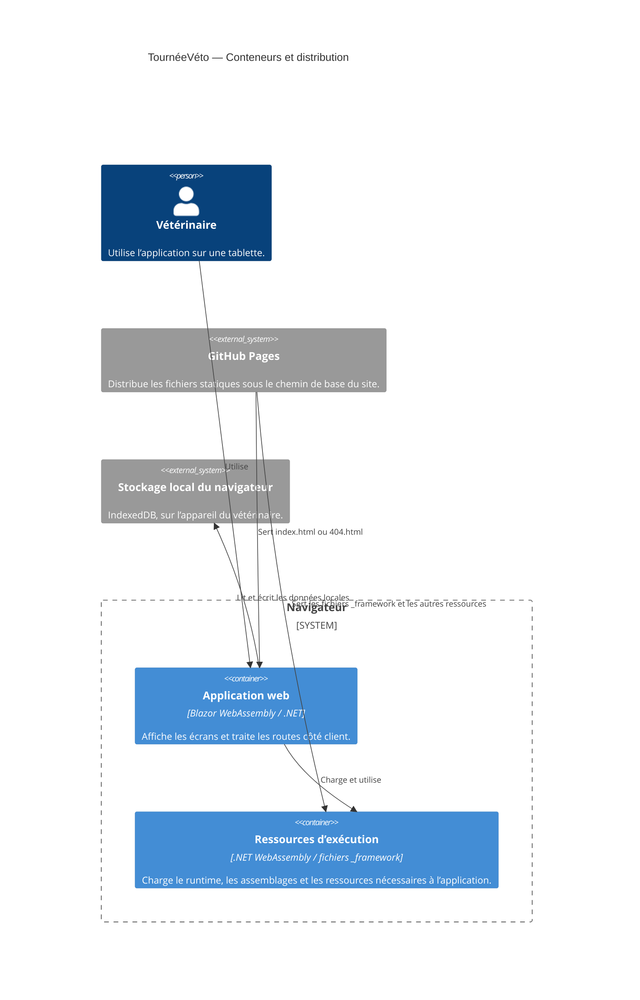

````markdown
# 0003 — Hébergement : chemin de base, rafraîchissement d’une page profonde et dossier `_framework`

- **Date :** 2026-10-08
- **Statut :** Proposé — à valider par l’équipe
- **Décideurs :** Équipe TournéeVéto
- **Liens :** [Contexte produit](../PRODUCT.md) · [Périmètre du MVP](../mvp.md) · [ADR 0001 — Persistance locale des données](./0001-statique.md)

## Contexte et problème

Le POC est une application Blazor WebAssembly statique publiée sur GitHub Pages. Elle doit fonctionner sous le chemin de base du dépôt, par exemple `/<nom-du-depot>/`, et non nécessairement à la racine du domaine.

Deux problèmes en découlent :

1. Les chemins des fichiers de l’application, notamment ceux du dossier `_framework`, doivent être résolus depuis la base de déploiement, même lorsqu’une URL de navigation contient un chemin profond.
2. GitHub Pages ne réécrit pas automatiquement une URL de route côté client vers `index.html`. L’ouverture directe ou le rafraîchissement d’une page profonde peut donc afficher une erreur 404 au lieu de charger l’application.

La solution doit rester compatible avec l’hébergement statique sur GitHub Pages et ne doit pas introduire de backend.

## Décision proposée

Configurer la base de l’application selon son emplacement de déploiement, conserver tous les fichiers publiés de Blazor WebAssembly, et fournir une page `404.html` permettant au routeur côté client de traiter les chemins profonds sur GitHub Pages.

- La valeur de `<base href>` doit correspondre au chemin de publication et se terminer par `/`.
  - Pages de projet GitHub : `/<nom-du-depot>/`.
  - Domaine publié à la racine : `/`.
- La valeur doit être définie pour l’environnement de publication, plutôt que supposée identique dans tous les environnements.
- Les liens de navigation internes doivent respecter cette base et éviter les chemins absolus commençant par `/` lorsqu’ils pointeraient hors du chemin du dépôt.
- Le résultat de publication doit conserver le dossier `_framework` et les autres fichiers générés par Blazor. Ils ne doivent être ni renommés, ni déplacés, ni exclus du déploiement.
- Le processus de publication doit fournir un `404.html` dérivé de la page d’entrée de l’application, avec la même valeur de `<base href>`. GitHub Pages servira cette page pour les URL inconnues; le routeur Blazor pourra alors afficher la route demandée.
- Le navigateur conserve l’URL profonde, et les ressources de l’application sont chargées depuis la base configurée, pas relativement à cette route.
- La page servie par GitHub Pages peut conserver un statut HTTP 404, même si l’application s’affiche correctement après le chargement. Cette solution vise le POC et ne remplace pas une réécriture serveur retournant un statut 200.

## Diagrammes C4

### Niveau 1 — Contexte système



### Niveau 2 — Conteneurs



## Options évaluées

### Configurer le chemin de base et utiliser `404.html`

**Avantages**
- Compatible avec l’hébergement statique GitHub Pages et le chemin d’un dépôt.
- Permet de conserver les URL de navigation côté client et de recharger une route profonde.
- Ne nécessite ni backend ni service de réécriture serveur.
- Maintient les ressources `_framework` accessibles depuis un emplacement stable.

**Inconvénients**
- Nécessite de produire et déployer `404.html` avec la bonne valeur de base.
- GitHub Pages peut répondre avec un statut HTTP 404, même lorsque l’application s’affiche ensuite correctement.
- Une erreur dans la base de déploiement peut rendre inaccessibles les ressources de l’application.

**Conclusion :** option proposée pour le POC, qui doit rester hébergé statiquement sur GitHub Pages.

### Utiliser des routes avec fragment (`#`) ou éviter les routes profondes

**Avantages**
- Peut éviter qu’un chemin de route soit interprété comme un fichier inexistant par l’hébergeur.
- Réduit la dépendance à un mécanisme de repli de l’hébergement.

**Inconvénients**
- Modifie la forme des URL et l’expérience de navigation.
- Ne répond pas aussi directement au besoin de conserver des routes lisibles et de rafraîchir une page profonde.

**Conclusion :** ne pas retenir pour le POC, sauf si la solution `404.html` s’avère incompatible avec l’implémentation retenue.

### Utiliser un hébergeur avec réécriture vers `index.html`

**Avantages**
- Peut retourner `index.html` avec un statut 200 pour toute route applicative.
- Évite de s’appuyer sur une page de repli retournée avec un statut 404.

**Inconvénients**
- Change la plateforme d’hébergement prévue.
- Ajoute une configuration qui n’est pas nécessaire pour démontrer le parcours du POC.

**Conclusion :** ne pas retenir pour le POC. Réévaluer si un hébergement ultérieur exige des statuts HTTP 200 pour les routes profondes.

## Conséquences

### Positives

- L’application peut être publiée sous le chemin de base d’un dépôt GitHub Pages.
- Les ressources générées par Blazor, dont `_framework`, sont demandées depuis le bon emplacement.
- Une route profonde peut être ouverte directement ou rechargée sans que l’utilisateur soit bloqué par une page d’erreur GitHub Pages.
- La solution préserve l’architecture statique sans backend.

### Négatives et limites

- Le chemin de base doit rester cohérent entre la configuration de publication, `index.html`, `404.html` et l’emplacement réel du site.
- Une page profonde peut s’afficher avec un statut HTTP 404 dans les outils du navigateur ou certains outils de supervision.
- Le repli `404.html` ne garantit pas à lui seul le fonctionnement hors ligne; la mise en cache de l’application relève de la stratégie PWA et doit être vérifiée séparément.
- Le dossier `_framework` fait partie des artefacts requis : un déploiement incomplet rendra l’application inutilisable.

## Risques et mesures

| Risque | Impact | Mesure |
|---|---|---|
| Chemin de base absent, erroné ou sans `/` final | Échec du chargement de l’application ou de ses ressources | Définir la base dans la publication et vérifier les URL générées pour les environnements ciblés. |
| `404.html` absent ou différent de la page d’entrée | Une route profonde affiche une erreur ou ne démarre pas l’application | Générer `404.html` à partir de la page publiée et tester une URL profonde directement sur le site déployé. |
| Ressources `_framework` omises ou déplacées | Le runtime WebAssembly ou les assemblages ne chargent pas | Déployer l’intégralité des artefacts de publication et vérifier les requêtes réseau vers `_framework`. |
| Chemin d’asset relatif à la route courante | Échec des ressources lors d’un accès direct à une page profonde | Ancrer les ressources à la base configurée et tester le rafraîchissement d’une URL profonde. |
| Statut HTTP 404 mal interprété par un outil ou un utilisateur | Faux signal d’indisponibilité malgré l’application affichée | Documenter cette limite du repli GitHub Pages; réévaluer l’hébergement si un statut 200 devient requis. |
| Cache hors ligne incomplet | Application indisponible après perte du réseau | Tester séparément le parcours hors ligne après un premier chargement en ligne, conformément au périmètre du MVP. |

## Critères d’acceptation

- La publication sur GitHub Pages utilise le chemin de base correspondant à l’emplacement réel du site.
- La page d’entrée et `404.html` utilisent la même base et sont présentes dans les artefacts publiés.
- Le dossier `_framework` et ses fichiers requis sont présents sous le chemin publié.
- L’application s’ouvre à partir de la page d’entrée publiée.
- Une URL de route profonde peut être ouverte directement et rafraîchie; l’application démarre et affiche la route attendue.
- Les requêtes aux ressources `_framework` réussissent depuis la page d’entrée comme depuis une URL profonde.
- Aucune API ni aucun backend n’est requis pour charger l’application ou ses ressources.

## Références

- [Contexte produit](../PRODUCT.md)
- [Périmètre du MVP](../mvp.md)
- [ADR 0001 — Persistance locale des données](./0001-statique.md)
````